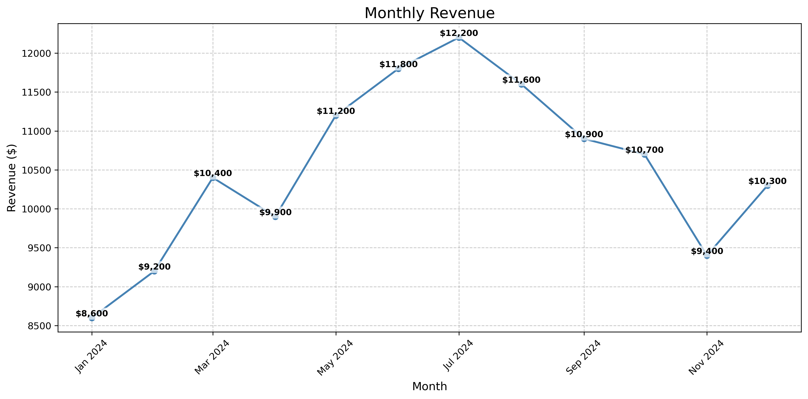

# Online Store Sales Analysis (Portfolio Project)

## Project Summary

I analyzed 12 months of sales data from a fictional online store. The dataset was pre-processed, so it couldn't lead me to many great insights, but some useful conclusions were made.

## Monthly Revenue Trend

**Key Insights:**

This chart shows monthly revenue tendencies over 12 months. Revenue is stronger during the middle of the year and weaker at the beginning and end. Useful and trustworthy conclusions can't be drawn from this chart alone due to the lack of information we have about the online store or its products. It must be analyzed alongside Monthly Marketing Spend, Monthly Visitors, and Monthly Orders.

## Monthly Marketing Spend

**Key Insights:**

This chart displays monthly marketing expenditure trends. The spending patterns will be cross-referenced with revenue and visitor data to understand ROI.

## Monthly Visitors

**Key Insights:**

This chart shows monthly visitor traffic to the online store. Understanding visitor volume is essential for analyzing conversion rates and the relationship between marketing spend and store traffic.

## Monthly Orders

**Key Insights:**

The graphs clearly show correlation, which tells us that Monthly Revenue depends on Monthly Orders, which depends on Monthly Visitors, which depends on Monthly Marketing Spend.

**Analysis:**

The straightforward conclusion would be that if marketing spend were increased, revenue would increase with it. However, this would only be true if the online store is not selling mid-year specific products, which would explain why marketing is cut back during the beginning and end of the year. Yet revenue could still benefit from holiday campaigns, which—as the Monthly Marketing Spend chart shows—the store doesn't practice or needs improvement in. 

## Monthly Average Cart Value

**Analysis:**

I created this chart to see how much people spend per transaction in this online store. The approximately $20 average cart value tells us that this store doesn't specialize in expensive products or sell wholesale, which means it could greatly benefit from holiday commercial campaigns.

## Conversion Rate

**Analysis:**

I calculated the conversion rate between visitors and orders to see how often visits turn into actual orders and found that this number is quite low. This could result from several factors: an unappealing website, confusing user interface, limited product variety, poor search functionality, inadequate product descriptions, or weak product presentation with images. A conversion rate this low is likely a combination of these issues.

## Conclusion

- Marketing spend appears to increase revenue
- The conversion rate between visitors and orders is quite low

## Recommendations

1. **Increase Marketing Spend strategically**: This store should increase marketing spend in months where it sees the most potential, considering the products they sell. Monitor how well the marketing spend pays off.

2. **Develop holiday campaigns**: Holiday events are great opportunities to increase revenue and encourage customers to return. They also attract new visitors—when a gifted product impresses someone, they're likely to seek out the store themselves.

3. **Improve conversion rate**: Address the factors causing the low visitor-to-order conversion rate:
   - Conduct user research on website appeal and usability
   - Improve product variety and search functionality
   - Enhance product descriptions and add high-quality images
   - Track search queries on your website and consider selling the most-searched products you don't currently offer
